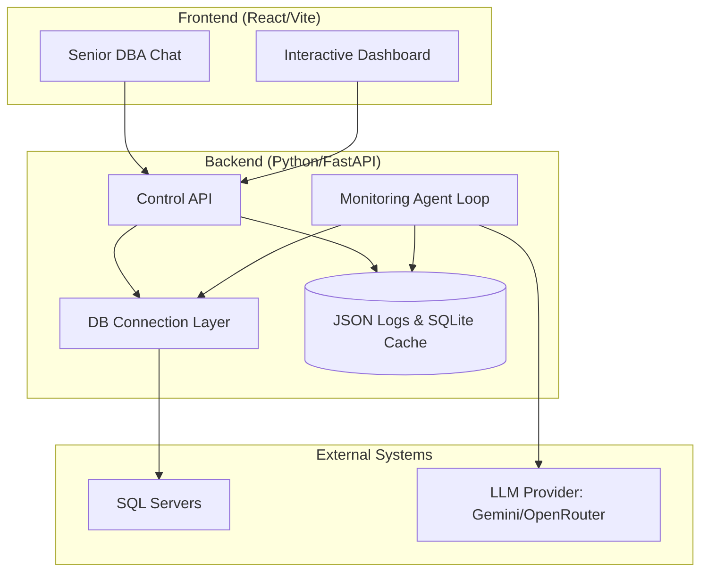

# 🩺 DB-HEALTH-AGENT: Autonomous Database Observability

**DB-HEALTH-AGENT** is a professional-grade, autonomous observability system designed to monitor SQL Server environments, provide AI-powered diagnostics with a "Senior DBA" persona, and execute automated maintenance tasks.

---

## 🏗 System Architecture

The project is structured into three main layers: the **Monitoring Agent**, the **Control API**, and the **Interactive Dashboard**.



---

## 🚀 Core Features

### 1. Autonomous Monitoring Loop
The agent runs in the background, executing a suite of health checks every N seconds (configurable):
- **Connectivity**: Validates link status.
- **Latency**: Measures response times.
- **Freshness**: Checks for stale data in critical tables.
- **Row Count**: Monitors table growth or unexpected data loss.
- **Errors**: Scans SQL Server logs for internal errors.
- **DB Size**: Monitors Log vs. Data file sizes (Critical for identifying saturation).

### 2. AI Reasoning Layer ("The Veterano")
Instead of cryptic error codes, the agent uses LLMs to provide human-readable diagnostics.
- **Persona**: A Senior DBA with 50+ years of experience. Direct, technical, and slightly grumpy.
- **Context-Aware**: The AI receives a curated "Context Packet" with the latest metrics and recommended actions.
- **Interactive Chat**: Users can chat with the AI to ask for deeper insights or request maintenance execution.

### 3. Automated Maintenance
The system can suggest and execute SQL scripts based on health results:
- **ShrinkDB**: Cleans up saturated transaction logs.
- **Cleanup**: Removes temporary or corrupted data.
- **Restore**: Automated recovery procedures.

---

## 🛠 Project Structure

```text
db-health-agent/
├── backend/
│   ├── app/                # Core Logic
│   │   ├── agent.py        # Orchestrator
│   │   ├── analyzer/       # LLM Reasoning & Rules
│   │   ├── checks/         # Health Check Implementations
│   │   └── storage/        # Persistence (JSON/SQLite)
│   ├── api/                # FastAPI Routes
│   ├── db/                 # SQL Maintenance Scripts
│   └── main.py             # Entry Point
├── frontend/
│   ├── src/
│   │   ├── App.tsx         # Main UI & Chat Logic
│   │   └── index.css       # Custom Design System
│   └── vite.config.ts
└── docker-compose.yml
```

---

## ⚙️ Configuration & Setup

### Prerequisites
- Python 3.9+
- Node.js 18+
- SQL Server connectivity (requires ODBC Driver 17/18)

### Environment Variables (.env)
Create a `.env` file in the root:
```bash
# Agent Config
RUN_INTERVAL_SEC=60
LOG_DIR=logs

# LLM Config
LLM_PROVIDER=gemini
LLM_API_KEY=your_api_key_here
LLM_MODEL=gemini-1.5-flash

# Servers (Example format for servers.yaml)
# The agent loads servers from a YAML file for easier management.
```

### Installation
1. **Backend**:
   ```bash
   cd backend
   pip install -r requirements.txt
   python main.py
   ```
2. **Frontend**:
   ```bash
   cd frontend
   npm install
   npm run dev
   ```

---

## 🧠 AI Diagnostic Flow

1. **Scan**: The Agent collects metrics.
2. **Analysis**: The Rule Engine classifies results (OK/WARNING/CRITICAL).
3. **Reasoning**: Metrics are packed into JSON and sent to the LLM.
4. **Narrative**: The LLM generates a diagnostic in Spanish.
5. **Caching**: The narrative is cached in SQLite to avoid redundant API calls.

---

## 📊 Monitoring & Metrics
The system exposes a Prometheus-compatible endpoint at port `8000`:
- `scan_duration_seconds`: Performance of health checks.
- `incidents_total`: Count of CRITICAL/WARNING events.
- `llm_cache_hits_total`: Efficiency of the reasoning layer.

---

## 👨‍💻 Contributing
To add a new health check:
1. Create a new file in `backend/app/checks/`.
2. Implement a `run(server_config, thresholds)` function.
3. Register it in `backend/app/agent.py`.
