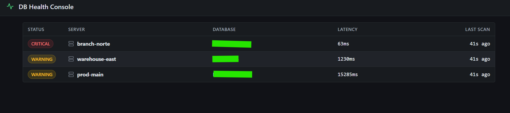
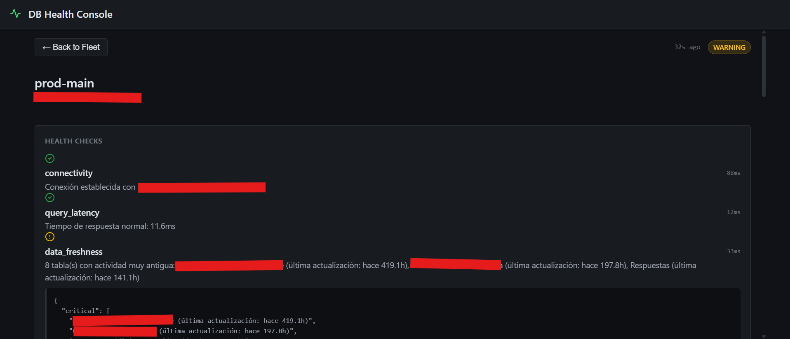
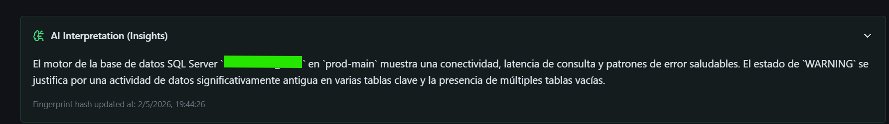

# 🛡️ DB Health Agent

Motor de observabilidad para SQL Server orientado a operación real: detecta degradación, filtra ruido, prioriza incidentes y entrega contexto accionable sin depender de dashboards inflados ni alertas inútiles.

Este proyecto fue diseñado con una premisa simple: en monitoreo, el problema no es “ver métricas”, es separar señal de ruido lo suficientemente rápido como para tomar decisiones sin revisar 50 dashboards.

---

## El problema

En entornos con múltiples instancias de SQL Server, los sistemas tradicionales de monitoreo generan demasiado ruido:

- Alertas por tablas que “no crecieron”, aunque operativamente no deberían moverse.
- Falsos positivos por ventanas horarias (backups, procesos batch, catálogos estáticos).
- Dashboards llenos de métricas sin contexto real.
- Alertas que detectan síntomas, pero no explican impacto ni prioridad.

El resultado: fatiga operacional.

El objetivo de este proyecto no fue construir otro dashboard bonito, sino un sistema capaz de responder una pregunta mucho más útil:

> “¿La base está sana operacionalmente y qué debería importarme ahora?”

---

## Qué hace

DB Health Agent monitorea múltiples bases SQL Server y combina tres capas de análisis:

### 1. Capa Determinística
Chequeos rápidos y baratos para detectar fallos inmediatos:

- Conectividad
- Latencia de consulta
- Patrones de error
- Bloqueos
- Freshness de datos
- Conteo de filas

### 2. Capa Contextual
Interpreta el comportamiento de la base usando heurísticas operacionales:

- Distingue tablas estáticas vs tablas transaccionales
- Detecta degradación lenta (*slow bleed*)
- Filtra falsos positivos
- Prioriza incidentes por impacto operacional

### 3. Capa de IA (Opcional)
Usa un LLM como intérprete, no como motor de detección.

La IA no decide si algo está roto.  
La IA traduce incidentes en contexto humano.

Esto permite generar resúmenes accionables sin convertir el monitoreo en una máquina de quemar tokens.

---

## Decisiones técnicas (y por qué)

## SQLite + JSON en vez de Redis/Postgres

El estado del sistema se persiste localmente usando:

- JSON para snapshots
- SQLite para historial y fingerprinting

### ¿Por qué?

Porque el agente debe seguir funcionando incluso si la infraestructura externa está caída.

Elegí sacrificar escalabilidad horizontal masiva a cambio de:

- cero dependencias externas
- despliegue simple
- portabilidad
- resiliencia operacional

No es una decisión “de moda”.  
Es una decisión de supervivencia.

---

## IA con control de costos

El error más obvio era mandar cada ciclo al LLM.

Eso escala mal, cuesta dinero y genera ruido narrativo.

La solución fue implementar **Incident Fingerprinting**:

- cada incidente genera una huella semántica
- si el estado no cambió, no se vuelve a llamar al modelo
- si el incidente muta, se recalcula contexto
- si no muta, se reutiliza narrativa cacheada

Resultado:

- menos ruido
- menos costo
- mismo contexto útil

La IA solo corre cuando cambia algo que importa.

---

## Slow Bleed Detection

Uno de los problemas más peligrosos en observabilidad no es el fallo brusco.

Es el deterioro lento.

Un sistema puede perder 2% de datos por ciclo durante horas sin gatillar alertas por umbral.

Para resolverlo, el agente no compara solo contra el ciclo anterior:

- T-1 → shock inmediato
- T-1h → degradación corta
- T-24h → desgaste lento

Esto permite detectar pérdida progresiva sin depender de saltos violentos.

---

## Arquitectura

El sistema está dividido en componentes desacoplados:

### Worker
Recolecta métricas, ejecuta chequeos, aplica heurísticas y persiste estado.

### API
Expone el estado del sistema en modo solo lectura.

### Frontend
Consola SRE-first para triage rápido.

Cada componente falla de forma independiente.

Si el frontend cae, el monitoreo sigue.  
Si la API cae, el worker sigue.  
La observabilidad no depende de la capa visual.

---

## Consola SRE-First

La UI no fue diseñada para “verse moderna”.

Fue diseñada para responder rápido bajo fatiga.

Principios de diseño:

- severidad primero
- densidad alta
- ruido visual mínimo
- evidencia antes que decoración
- contexto antes que estética

No hay glassmorphism.  
No hay métricas infladas.  
No hay “cards” gigantes.

Solo señal operacional.

---

## Capturas

## Vista general de flota
Estado consolidado de múltiples servidores con foco en severidad, latencia y último escaneo.



---

## Detalle por servidor
Desglose completo de checks, tiempos y evidencia cruda para diagnóstico rápido.



---

## Capa de interpretación IA
Resumen contextual generado solo cuando cambia el incidente.



---

## Stack

### Backend
- Python 3.12
- FastAPI
- Pydantic
- Loguru

### Frontend
- React
- TypeScript
- Vite
- TanStack Query
- Wouter

### Observabilidad
- SQLite
- JSON snapshots
- Prometheus

### IA
- Gemini / OpenAI (opcional)

---

## Lo interesante de este proyecto

Este proyecto no intenta demostrar que “sé usar IA”.

Demuestra algo más útil:

- criterio operacional
- diseño orientado a incidentes
- reducción de ruido
- control de costo
- separación de responsabilidades
- observabilidad con contexto

No es un dashboard.

Es una pieza de ingeniería pensada para producción.


---

## Demo local

```bash
docker-compose build
docker-compose up -d
Frontend: http://localhost:3000
API: http://localhost:8080